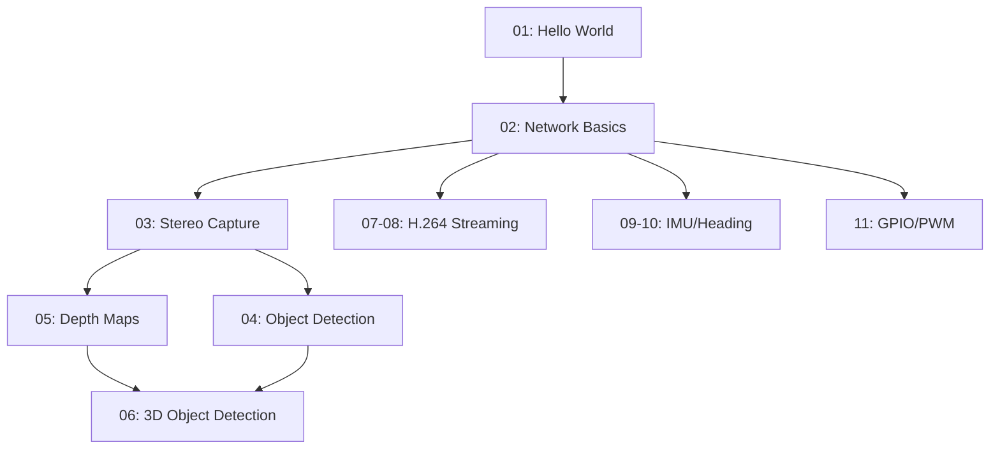

# RAiV Python Examples Repository

[](https://www.python.org/)
[](https://www.ml-vpn.com/en/robotic_ai_vision.html)
[](LICENSE)

Robotic Ai Vision (RAiV) is an intelligent stereo camera system that combines 3D vision with powerful onboard processing. Built for robotics and automation applications, RAiV delivers real-time depth sensing, object detection, heading estimation, and low-latency video streaming—all through an open-source software ecosystem.

For technical information, see [RAiV Product Page](https://www.ml-vpn.com/en/robotic_ai_vision.html).
For usage, see [RAiV guide](https://www.ml-vpn.com/en/guide_RAiV.html) and [our blog](https://www.ml-vpn.com/en/blog.html).


This repository contains Python example code demonstrating RAiV's capabilities, from basic setup to advanced edge AI applications. Examples run directly on RAiV's onboard processor or communicate with a PC client for distributed processing.

---

## 📁 Repository Structure

```
raiv-examples/
├── 01A-hello_world/          # Basic "Hello World" script (Blog Version)
├── 01B-hello_world/          # Basic "Hello World" script
├── 02A-net_comm-Client/      # TCP client implementation (Blog Version)
├── 02B-net_comm-Server/      # TCP server implementation (Blog Version)
├── 02C-net_comm/             # TCP client implementation
├── 03-capture_stereo/        # Stereo image capture and transmission
├── 04-obj_detect/            # YOLOv11 object detection on EdgeTPU
├── 05-depth_map/             # Real-time depth map generation with OpenCV
├── 06-obj_depth/             # 3D object localization (YOLO + depth fusion)
├── 07-h264_streaming/        # Low-latency H.264 video streaming
├── 08-h264_w_auto_exp_gain/  # Low-latency H.264 video streaming with automatic exposure/gain
├── 09-IMU_data_acqusition/   # IMU sensor data acquisition
├── 10-heading_estim/         # Heading estimation using 6DoF IMU
└── 11-gpio_pwm/              # GPIO and PWM control examples
```

---

## 🚀 Getting Started

### Prerequisites
- RAiV device (https://www.ml-vpn.com/en/robotic_ai_vision.html)
- Python 3.8+ on development machine
- Network connectivity between PC and RAiV (via Ethernet/WiFi)

### Setup Workflow
1. **Connect to RAiV**  
   Access RAiV's web interface at `http://<RAiV_IP>` (default: `192.168.10.55`)

2. **Upload Code**  
   Use the browser-based IDE to upload Python scripts to RAiV:
   - Navigate to **Python Deployment → Upload Python Scripts**
   - Upload files from example folders (e.g., `01A-hello_world/user_main.py`)

3. **Run Examples**  
   RAiV has a sandboxed Python environment to run user's Python codes. After the python files are uploaded by using the web interface, RAiV checks the codes for semantic correctness and executability. If all of the codes pass the checks, then RAiV runs them.

4. **PC-Side Execution**  
   For client examples (e.g., `01B-hello_world`, `02A-net_comm-Client`):
   ```bash
   cd 02B-net_comm-Server/
   python pc_sender.py
   ```

---

## 📚 Example Guide

| # | Example | Description | Target |
|---|---------|-------------|--------|
| 01 | **Hello World** | First steps with RAiV development: browser-based code upload and execution | RAiV + PC |
| 02 | **Network Communication** | TCP client/server architecture using `qCU_Net` module (4-byte header + JSON payload) | RAiV ↔ PC |
| 03 | **Stereo Capture** | Access RAiV's data pipeline to capture stereo pairs and transmit via TCP using `qCU_Data` | RAiV → PC |
| 04 | **Object Detection** | Run YOLOv11 on EdgeTPU: model upload, inference, and postprocessing | RAiV → PC |
| 05 | **Depth Mapping** | Generate real-time depth maps using calibrated stereo cameras and OpenCV disparity algorithms | RAiV → PC |
| 06 | **3D Object Detection** | Fuse YOLO detections with depth data for 3D object localization (sensor fusion) | RAiV → PC |
| 07–08 | **H.264 Streaming** | Low-latency video streaming via hardware encoder + WebSocket; includes auto-exposure/gain control | RAiV → PC |
| 09–10 | **IMU & Heading** | Acquire 6DoF IMU data (gyro + accelerometer) and implement heading estimation algorithms | RAiV → PC |
| 11 | **GPIO/PWM Control** | Interface with hardware peripherals using GPIO and PWM outputs | RAiV |

---

## 🔑 Key Modules

RAiV's Python SDK provides specialized modules for hardware access:

```python


# Stdout hooking
import qCU_Print

# Network communication
import qCU_Net

# Stereo data pipeline
import qCU_Data

# H.264 streaming
import qCU_Stream

# Camera control
import qCU_CCtrl

# GPIO & PWM control
import qCU_PinBus
```

> 💡 **Note**: Full SDK documentation available at [https://www.ml-vpn.com/en/guide_RAiV.html#py-sdk)

---

## ⚙️ Requirements

**PC-side**:
```bash
Pillow
PyAV
websocket-client
```

---

## 🌐 Learning Path

We recommend progressing through examples in this order:



---

## 🤝 Contributing

Contributions are welcome! Please follow these steps:
1. Fork the repository
2. Create a feature branch (`git checkout -b feature/your-feature`)
3. Commit your changes (`git commit -am 'Add feature'`)
4. Push to the branch (`git push origin feature/your-feature`)
5. Open a Pull Request

---

## 📄 License

This project is licensed under the MIT License - see the [LICENSE](LICENSE) file for details.

---

## 📬 Support & Resources

- **Official Documentation**: https://www.ml-vpn.com/en/guide_RAiV.html#py-sdk
- **Hardware Specs**: https://www.ml-vpn.com/en/robotic_ai_vision.html
- **Issue Tracker**: [GitHub Issues](https://github.com/ML-VPN/RAiV_Examples/issues)

> 💡 **Pro Tip**: Start with `01A-hello_world` and `02C-net_comm` to establish your development workflow before advancing to computer vision examples.

*RAiV: See the world in 3D at the edge.* 🤖👁️👁️
